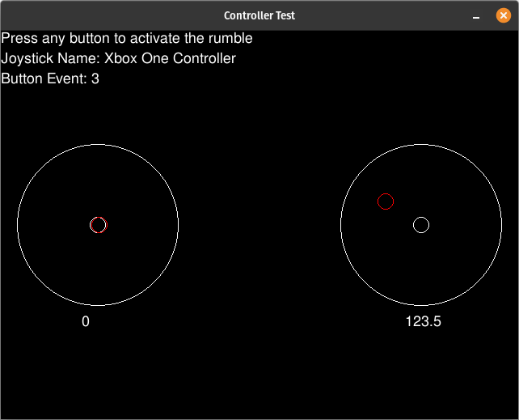

# Controller Test

### [_`Click here to download`_](https://github.com/Mr0o/ControllerTest/archive/refs/heads/master.zip)

</br>

## **_What is this?_**
This is a simple program that allows you to test your controller's joysticks and buttons.

- Works with just about any controller with xinput or dinput support. (Xbox 360, Xbox One, PS3, PS4, etc.) 

- This can be useful for testing that a controller is working properly or for testing your controller with pygames button event handler. 
    
    Some controllers have different button mappings than others, this program can help you find out what button is what.

</br>

# Screenshot


</br>

# **How to run**

**This program is compatible with both Windows and Linux. MacOS has not been tested but it should also work.**

1) Install Python 3
2) Download this repository using [_**this link**_](https://github.com/Mr0o/ControllerTest/archive/refs/heads/master.zip) or if you have _git_ installed you can use the command:
```bash
    git clone https://github.com/Mr0o/Pygame_Controller.git
```
3) Open the folder in your terminal and run the command:
```bash
    python3 controller_test.py
```

If pygame is installed correctly you should now see a window that looks similar to the screenshot above.

If you have an ImportError, you probably need to install pygame. You can do so by running the command:
```bash
    python3 -m pip install pygame
```
or
```bash
    pip3 install pygame
```

</br>
<br/>

## License
Anyone is free to use this code for whatever they want. If you have any questions or suggestions feel free to contact me. This project uses the MIT license.